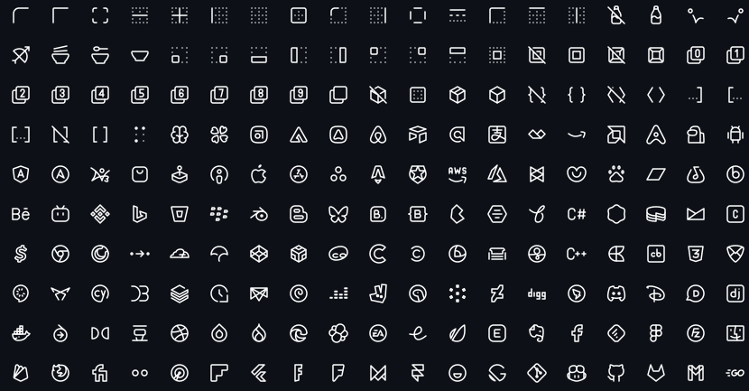

# Filament Tabler Icons

[](https://packagist.org/packages/daljo25/filament-tabler-icons)
[](https://packagist.org/packages/daljo25/filament-tabler-icons)
[](LICENSE.md)

A Filament **4.x / 5.x** plugin that integrates the full **Tabler Icons** set, allowing you to use them seamlessly across Filament forms, tables, actions, resources, and navigation.

Tabler Icons is a free and open-source SVG icon set designed to work beautifully with modern UIs.



---

## Requirements

* PHP **8.2+**
* Laravel **10+**
* Filament **4.x or 5.x**

---

## Installation

Install the package via Composer:

```bash
composer require daljo25/filament-tabler-icons
```

(Optional) You can publish the configuration file to customize the plugin's behavior:

```bash
php artisan vendor:publish --tag=filament-tabler-icons-config
```

---

## Configuration

The configuration file allows you to control the automatic icon replacement and define custom overrides.

```php
return [
    // Enable or disable automatic icon replacement
    'enabled' => true,

    // Define custom icon overrides
    'icons' => [
        'panels::global-search-field' => 'tabler-zoom-2',
    ],
];
```

### Icon Aliases

You can override any of Filament's default icon aliases. For a full list of available aliases, check the [official Filament documentation](https://filamentphp.com/docs/5.x/styling/icons#available-icon-aliases).

---

## Automatic Icon Replacement

Once installed, this plugin **automatically replaces all Filament UI icons** with Tabler Icons, including:

### Panels Icons
- Sidebar navigation icons
- Collapse/expand buttons
- Search field icon
- Filter buttons
- Dashboard icons
- User menu icons
- Theme switcher icons (Light, Dark, System)
- Database notifications icons

### Notifications Icons
- Notification status icons (success, danger, warning, info)
- Close button icon
- Empty state icons

### Widgets Icons
- Chart filter icons

This means you don't need to do anything—Tabler Icons will be used throughout your Filament admin panel automatically!

---

## Usage

### Import the enum

```php
use Daljo25\FilamentTablerIcons\Enums\TablerIcon;
```

---

### Forms

```php
use Filament\Forms;
use Daljo25\FilamentTablerIcons\Enums\TablerIcon;

Forms\Components\TextInput::make('email')
    ->prefixIcon(TablerIcon::Mail)
    ->email()
    ->required();
```

---

### Tables

```php
use Filament\Tables;
use Daljo25\FilamentTablerIcons\Enums\TablerIcon;

Tables\Columns\IconColumn::make('active')
    ->boolean()
    ->trueIcon(TablerIcon::Check)
    ->falseIcon(TablerIcon::X);
```

---

### Actions

```php
use Filament\Actions;
use Daljo25\FilamentTablerIcons\Enums\TablerIcon;

Actions\Action::make('edit')
    ->icon(TablerIcon::Edit);
```

---

### Resource Navigation Icon

```php
use Filament\Resources\Resource;
use Daljo25\FilamentTablerIcons\Enums\TablerIcon;

final class UserResource extends Resource
{
    protected static string|BackedEnum|null $navigationIcon =
        TablerIcon::Users;
}
```

---

### Icon Scaling (optional)

Since the enum implements `ScalableIcon`, you can control icon size:

```php
use Filament\Support\Enums\IconSize;
use Daljo25\FilamentTablerIcons\Enums\TablerIcon;

TablerIcon::Settings->scale(IconSize::Large);
```

---

## Available Icons

All icons are provided via the `TablerIcon` enum.

Icon names follow the official Tabler naming convention (kebab-case internally, PascalCase enum names).

You can browse the full icon set at:
👉 [https://tabler.io/icons](https://tabler.io/icons)

---

## Contributing

Contributions are welcome!

If you want to:

* add missing icons
* improve DX
* optimize performance
* improve documentation

Please open a pull request or issue.

---

## Credits

* **Daljomar Morillo** ([@daljo25](https://github.com/daljo25))
* [Tabler Icons](https://tabler.io/icons)
* Inspired by [filament-lucide-icons](https://github.com/CodeWithDennis/filament-lucide-icons)

---

## License

The MIT License (MIT).
See [LICENSE.md](LICENSE.md) for more information.